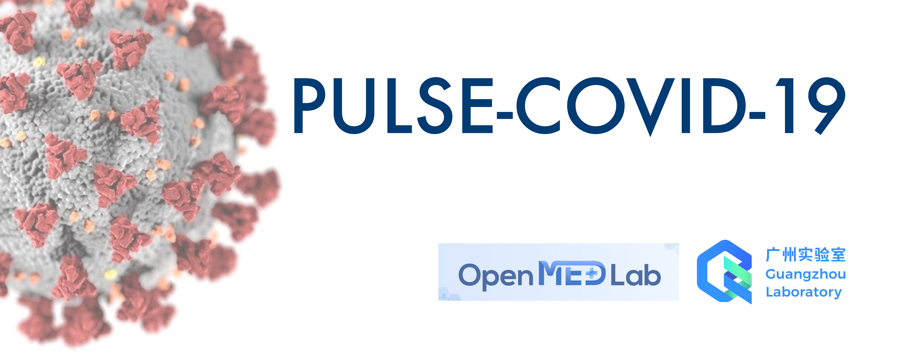

# PULSE-COVID-19: A Large Language Model for knowledge extraction on COVID-19
<!-- select Model and/or Data and/or Code as needed>
### Welcome to OpenMEDLab! 👋

<!--
**Here are some ideas to get you started:**
🙋â€â™€ï¸ A short introduction - what is your organization all about?
🌈 Contribution guidelines - how can the community get involved?
👩â€ğŸ’» Useful resources - where can the community find your docs? Is there anything else the community should know?
🿠Fun facts - what does your team eat for breakfast?
🧙 Remember, you can do mighty things with the power of [Markdown](https://docs.github.com/github/writing-on-github/getting-started-with-writing-and-formatting-on-github/basic-writing-and-formatting-syntax)
-->

<!-- Insert the project banner here -->

<p align="center" width="100%">

</p>

[](./LICENSE)
[](./MODEL_LICENSE)

This repository provides the official PyTorch implementation of the model **PULSE-COVID-19: A Large Language Model for knowledge extraction on COVID-19** <br>

## Introduction
This model was fine-tuned based on the [PULSE](https://github.com/openmedlab/PULSE) LLM, incorporating an in-house corpus of COVID-19 knowledge databases from the Guangzhou Laboratory. The objective was to augment the capabilities of LLMs in assimilating and responding to disease-specific knowledge. This enhanced understanding is expected to contribute towards future epidemic prevention and disease treatment efforts.

## Contributors
- Guangzhou Laboratory: [Yixue Li](https://scholar.google.com/citations?hl=en&user=Qv27G1cAAAAJ), [Feng Gao](https://scholar.google.com/citations?hl=en&user=deiLMp8AAAAJ), [Junwei Liu](https://scholar.google.com/citations?hl=en&user=VuuF5pIAAAAJ), Yiping Chen, Lu Zhou.

- Shanghai AI Laboratory: [Shaoting Zhang](https://scholar.google.com/citations?user=oiBMWK4AAAAJ&hl=en&oi=ao), [Xiaofan Zhang](http://www.qingyuan.sjtu.edu.cn/a/zhang-xiao-fan-1.html).

## Key Features
[//]: # (key feature bulletin points here)

- Developed a Large Language Model (LLM) specifically for the COVID-19 disease domain.
- Incorporated a comprehensive, in-house COVID-19 knowledge dataset from Guangzhou Laboratory.
- Provides more reliable question answering and knowledge extraction related to the COVID-19 epidemic and SARS-COV-2 virus.

<!-- [Code] may link to your project at your institute>
<!-- give a introduction of your project -->

## Details
> Large language models (LLMs) have demonstrated their promising performance in comprehending natural languages and adapting to multiple downstream tasks. Despite their robust generalized abilities, the use of LLMs in certain domains, notably in the medical and clinical fields, is limited due to the potential for inaccurate responses and incorrect knowledge extraction. The COVID-19 epidemic has had a global impact, causing millions of deaths and significantly affecting the world economy. As a response, scientists have carried out extensive basic and clinical research to understand the virological characteristics, mutational landscapes, and clinical aspects of the SARS-CoV-2 virus to aid in its diagnosis and treatment. This has resulted in thousands of scientific papers and the establishment of disease-specific regulatory mechanisms, presenting an opportunity for LLMs to fine-tune with these COVID-19-related datasets for reliable knowledge queries and responses. In this study, we combined the in-house COVID-19 disease knowledge datasets from our collaborator at Guangzhou Laboratory with our new LLM framework (PULSE), to construct a SARS-COV-2 disease-specific LLM model (PULSE-COVID-19). Our disease-specific LLM outperforms other existing LLMs of similar size of parameters in disease-related question answering and SARS-COV-2-related knowledge extraction, demonstrating the potential of applying LLMs in various specific domains.

## Get Started
### Installation
1. Download the contents of this repository to your local/remote server.

```bash
git clone https://github.com/openmedlab/PULSE-COVID-19
cd PULSE-COVID-19
```

2. Create a conda environment and install dependencies.

```bash
conda env create -f llm.yml
conda activate llm
```
### Evaluation

**Gradio**

```bash
python web_demo_gradio_gd.py
```

## COVID-19 Question Answering

---

**Q1: 新冠病毒感染人体细èƒçš„基本åŸç†æ˜¯ä»€ä¹ˆï¼Ÿ**

新冠病毒感染人体细èƒçš„基本åŸç†æ˜¯é€šè¿‡å…¶è¡¨é¢çš„刺çªè›‹ç™½ï¼ˆS蛋白）结åˆåˆ°äººä½“细èƒè¡¨é¢çš„ACE2蛋白上，ä»è€Œè¿›å…¥ç»†èƒå†…部。ACE2蛋白是一ç§ç»†èƒè†œä¸Šçš„å—体蛋白，在人体内广泛分布，特别是在肺部和肾è„中。当新冠病毒ä¸ACE2蛋白结åˆæ—¶ï¼Œç—…毒会利用ACE2蛋白的转è¿æœºåˆ¶è¿›å…¥ç»†èƒå†…部，并利用细èƒå†…的酶系统å¤åˆ¶è‡ªèº«ã€‚
在细èƒå†…，新冠病毒利用细èƒå†…的酶系统å¤åˆ¶è‡ªèº«ï¼Œå¹¶é‡Šæ”¾å‡ºç—…毒颗粒。这些病毒颗粒å¯ä»¥åœ¨ç»†èƒé—´ä¼ æ’­ï¼Œå¹¶æ„ŸæŸ“其他细èƒã€‚此外，新冠病毒还å¯ä»¥é€šè¿‡é£æ²«ä¼ æ’­ã€æ¥è§¦ä¼ æ’­å’Œç©ºæ°”传播等方å¼ä¼ æ’­ç»™ä»–人。
总之，新冠病毒感染人体细èƒçš„基本åŸç†æ˜¯é€šè¿‡å…¶è¡¨é¢çš„刺çªè›‹ç™½ç»“åˆåˆ°äººä½“细èƒè¡¨é¢çš„ACE2蛋白上，ä»è€Œè¿›å…¥ç»†èƒå†…部，利用细èƒå†…的酶系统å¤åˆ¶è‡ªèº«ï¼Œå¹¶é‡Šæ”¾å‡ºç—…毒颗粒，在细èƒé—´ä¼ æ’­ï¼Œå¹¶æ„ŸæŸ“其他细èƒã€‚

---

---

**Q2: 为什么新冠病毒感染对有基础疾病的患者ä¸å‹å¥½ï¼Ÿ**

新冠病毒感染对有基础疾病的患者ä¸å‹å¥½çš„åŸå› æœ‰ä»¥ä¸‹å‡ ä¸ªæ–¹é¢ï¼š
1.å…疫功能下é™ï¼šåŸºç¡€ç–¾ç—…会导致患者的å…疫功能下é™ï¼Œä½¿å¾—新冠病毒容易入侵体内并引起感染。
2.comorbidity：许多基础疾病都伴éšç€å…¶ä»–å¥åº·é—®é¢˜ï¼Œè¿™äº›å¥åº·é—®é¢˜å¯èƒ½ä¼šå¢åŠ æ‚£è€…感染新冠病毒并出ç°ä¸¥é‡åæœçš„é£é™©ã€‚
3.è¯ç‰©ä½¿ç”¨ï¼šæŸäº›è¯ç‰©å¯èƒ½ä¼šå½±å“患者的å…疫功能，或者ä¸æ–°å† ç—…毒相互作用，å¢åŠ æ„ŸæŸ“çš„é£é™©ã€‚
4.并å‘症：基础疾病往往会导致并å‘症，如高血å‹ã€ç³–尿病等，这些并å‘ç—‡å¯èƒ½ä¼šä½¿æ‚£è€…更容易出ç°ä¸¥é‡åæœï¼Œå¦‚呼å¸å›°éš¾ã€å¿ƒè„衰竭等。
因此，对äºæœ‰åŸºç¡€ç–¾ç—…的患者，建议采å–预防æªæ–½ï¼Œå¦‚佩戴å£ç½©ã€å‹¤æ´—手ã€ä¿æŒç¤¾äº¤è·ç¦»ç­‰ï¼Œä»¥å‡å°‘感染新冠病毒的é£é™©ã€‚如æœå‡ºç°å‘热ã€å’³å—½ã€å‘¼å¸å›°éš¾ç­‰ç—‡çŠ¶ï¼Œåº”åŠæ—¶å°±åŒ»ã€‚

---

---

**Q3: 如何定义新冠病毒å˜å¼‚株的致病力？**

新冠病毒å˜å¼‚株的致病力是指å˜å¼‚株引起疾病的能力。这å¯èƒ½æ¶‰åŠåˆ°å˜å¼‚株引起疾病的程度ã€ä¸¥é‡ç¨‹åº¦ã€æŒç»­æ—¶é—´ä»¥åŠæ˜¯å¦æ˜“äºæ²»ç–—等方é¢ã€‚
ç›®å‰ï¼Œç§‘学家们使用多ç§æ–¹æ³•æ¥è¯„估新冠病毒å˜å¼‚株的致病力。其中一ç§æ–¹æ³•æ˜¯ä½¿ç”¨ä¸´åºŠè¡¨ç°æ¥è¯„ä¼°å˜å¼‚株引起的疾病严é‡ç¨‹åº¦ã€‚例如，一些研究使用临床症状的严é‡ç¨‹åº¦æ¥è¯„ä¼°å˜å¼‚株引起的疾病，包括å‘热ã€å’³å—½ã€å‘¼å¸æ€¥ä¿ƒã€ä¹åŠ›ç­‰ç—‡çŠ¶çš„严é‡ç¨‹åº¦ã€‚
å¦ä¸€ç§æ–¹æ³•æ˜¯ä½¿ç”¨å®éªŒå®¤æ£€æµ‹æ¥è¯„ä¼°å˜å¼‚株引起的疾病。例如，一些研究使用细èƒåŸ¹å…»å®éªŒæ¥è¯„ä¼°å˜å¼‚株引起的病毒å¤åˆ¶èƒ½åŠ›ï¼Œæˆ–者使用动物å®éªŒæ¥è¯„ä¼°å˜å¼‚株引起的疾病严é‡ç¨‹åº¦ã€‚
此外，一些研究还使用æµè¡Œç—…学方法æ¥è¯„ä¼°å˜å¼‚株的致病力。例如，一些研究使用追踪病例的方法æ¥è¯„ä¼°å˜å¼‚株引起的疾病传播速度和范围。
总之，评估新冠病毒å˜å¼‚株的致病力是了解å˜å¼‚株引起的疾病的é‡è¦ä¸€æ­¥ï¼Œæœ‰åŠ©äºåˆ¶å®šæ›´æœ‰æ•ˆçš„预防和治疗方案。

---

---

**Q4: 人工智能方法在新冠疫情中å‘挥了什么作用？**

人工智能方法在新冠疫情中å‘挥了多ç§ä½œç”¨ï¼ŒåŒ…括：
1.病毒传播预测：利用机器学习算法，å¯ä»¥å¯¹æ–°å† ç—…毒传播进行预测，帮助政府制定更有效的防æ§æªæ–½ã€‚
2.病毒基因组测åºï¼šåˆ©ç”¨äººå·¥æ™ºèƒ½æ–¹æ³•ï¼Œå¯ä»¥å¿«é€Ÿã€å‡†ç¡®åœ°å¯¹æ–°å† ç—…毒的基因组进行测åºï¼ŒåŠ é€Ÿç—…毒研究进程。
3.ç–«è‹—ç ”å‘：利用人工智能方法，å¯ä»¥åŠ é€Ÿç–«è‹—ç ”å‘过程，æ高疫苗研å‘æˆåŠŸç‡ã€‚
4.临床诊断：利用人工智能方法，å¯ä»¥è¾…助医生进行新冠病毒临床诊断，æ高诊断准确ç‡ã€‚
5.追踪æ¥è§¦è€…：利用人工智能方法，å¯ä»¥è¿½è¸ªæ–°å† ç—…毒æ¥è§¦è€…，帮助政府进行疫情防æ§ã€‚
总之，人工智能方法在新冠疫情中å‘挥了多ç§ä½œç”¨ï¼Œä¸ºç–«æƒ…防æ§æ供了有力的支æŒã€‚

---

## Note

Please note that certain responses or conclusions provided by this model regarding COVID-19-specific knowledge queries may be inaccurate, outdated, or limited. Our team continuously strives to enhance the answers' accuracy and reliability by improving and updating the model's training corpus and algorithms. We greatly appreciate user feedback and corrections as they help us refine the model and deliver an improved service.

## License

The code of this project is licensed under Apache 2.0, and the model weights are licensed under GNU AGPL 3.0. If the models contained in this project, or any modified versions thereof, are used in a service which results in misleading or harmful statements causing adverse effects, the responsibility lies with the service provider and is not associated with or attributable to this project.


